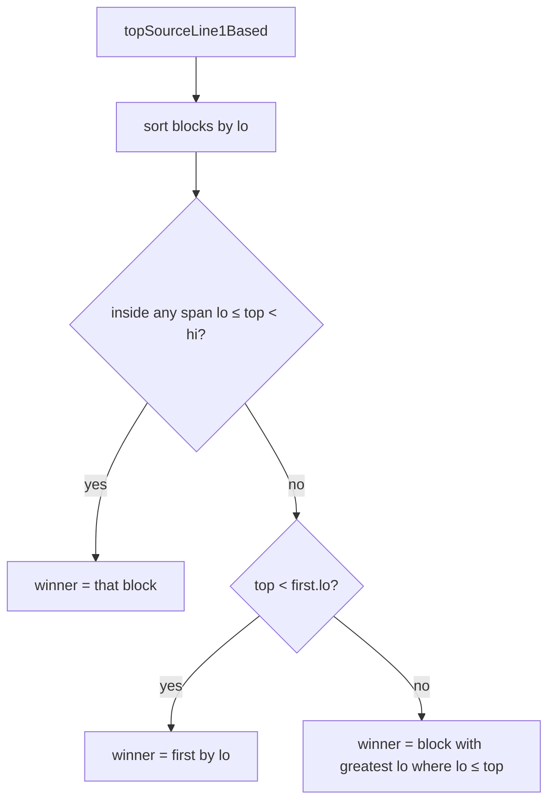
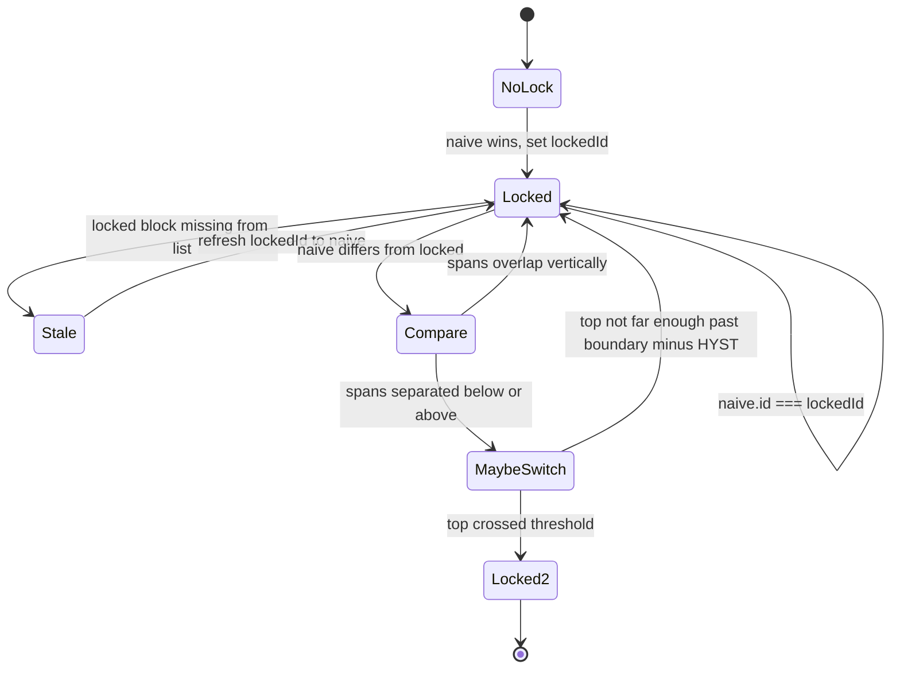

# `block-scroll-pickers.ts` — parallel-docs

Pure geometry for **which side-track block** should track the **source** viewport top (and the Schmitt-style twins for **parallel-docs→source**). Used by [`scroll-sync.ts`](../scroll-sync.ts/main.md) after `buildBlockScrollLinks` supplies `BlockScrollLink[]`.

## `BlockScrollLink`

Each link carries:

- **`parallelDocsLine`** — 0-based line of `<!-- parallelDocs:block id=… -->` in the companion Markdown.
- **`markerViewportHalfOpen1Based`** — `{ lo, hiExclusive }` in **1-based source lines**: viewport top belongs to this block when `lo <= top < hiExclusive`. Built from `marker:` anchors via [`markerViewportHalfOpen1Based`](../source-markers.ts/main.md) in `source-markers.ts`, or from `lines:` anchors as `[range.start, range.end + 1)`.

## Naive source pick (`pickBlockScrollLinkForSourceViewportTop`)

`blockStrictlyContainingSourceViewportLine` is the strict variant (true gaps return `null`). `sourceTopLineStrictlyBeforeFirstIndexLine` is the “prelude above every span” predicate. `parallelDocsProbeInStrictInterMarkerGap` is the markdown-line analogue for **inter-marker prose** between two block markers.

## Hysteresis (`pickBlockScrollLinkForSourceViewportWithHysteresis`)

Schmitt-style lock so edge noise does not flip the active block. After a **naive** pick, `resolveStickyHysteresisLock` clears the lock when naive is null, bootstraps `lockedId`, or compares **naive** vs **locked** spans:

Default thresholds: **`DEFAULT_SOURCE_VIEWPORT_HYSTERESIS_LINES`** (source lines) and **`DEFAULT_PARALLEL_DOCS_VIEWPORT_HYSTERESIS_LINES`** (markdown lines) for the parallel-docs-direction twin.

**Related:** [`source-markers.ts`](../source-markers.ts/main.md) · [`scroll-sync.ts`](../scroll-sync.ts/main.md)
