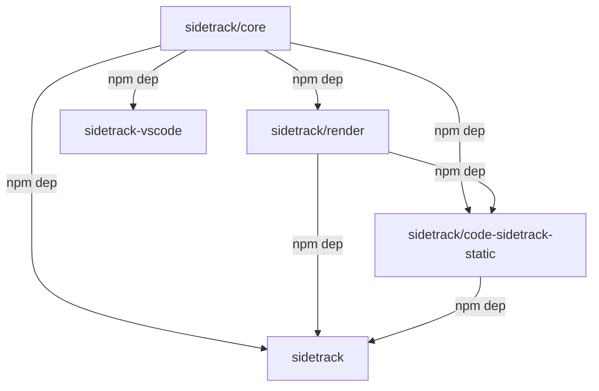

<!-- sidetrack:block id=readme-lede -->

# SideTrack — architecture angle

This **angle** is a second voice on the same `README.md` source: high-level map of the monorepo, not a second README. For **roles** (libraries vs tooling vs static generator), see the **[Main](https://github.com/d-led/sidetrack/blob/main/.sidetrack/source/README.md/main.md)** angle.

**Package dependencies** (edges follow `package.json` `dependencies`; [`@sidetrack/core`](https://www.npmjs.com/package/@sidetrack/core) has no in-repo package deps):

<!-- sidetrack:page-break -->

<!-- sidetrack:block id=readme-why -->

<!-- sidetrack:page-break -->

<!-- sidetrack:block id=readme-user-guides -->

- **[@sidetrack/core](https://www.npmjs.com/package/@sidetrack/core)** — paths, index, config merge, Angles resolution, Git-backed evidence.
- **[@sidetrack/render](https://www.npmjs.com/package/@sidetrack/render)** — Markdown → safe HTML, static code browser shell (dual panes, optional multi-angle selector, block-aware scroll when the index agrees).
- **[sidetrack](https://www.npmjs.com/package/sidetrack)** — `init`, `validate`, **`migrate-angles`** (flat → per-source folders), `render`, `pages` inputs.
- **[@sidetrack/code-sidetrack-static](https://www.npmjs.com/package/@sidetrack/code-sidetrack-static)** — thin consumer that feeds `renderCodeBrowserHtml` for GitHub Pages.

Use **Angle** on the static site when this file exists alongside `main.md` and both are listed under `[angles].definitions` in `.sidetrack.toml`.

<!-- sidetrack:page-break -->

<!-- sidetrack:block id=readme-mobile-flip-check -->

## Narrow viewport check

On a narrow viewport, the shell flips between **Source** and **SideTrack** instead of showing both columns at once. That mobile flip still needs to keep the currently active README block aligned when you switch panes.

Use this architecture angle to verify the same behavior as the main angle: scroll near the bottom, flip from source to sidetrack and back, and confirm the visible block stays paired after each flip.
