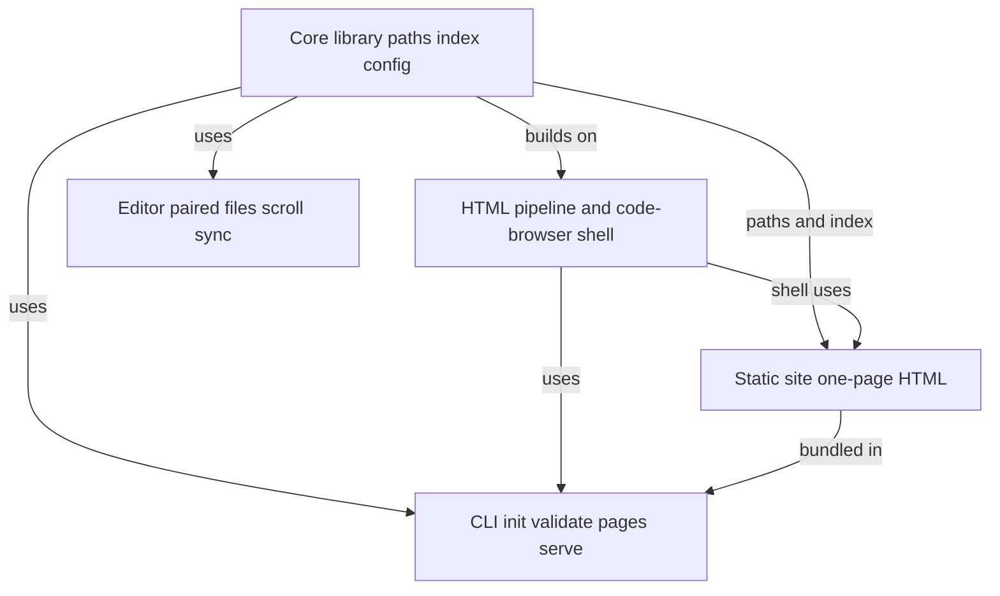

# SideTrack — quick-start

<!-- sidetrack:block id=readme-lede -->

_You have the main [`README.md`](https://github.com/d-led/sidetrack/blob/main/README.md) in the left column: packages, scripts, release flow. This file **is** sidetrack for that README—the voice-over beside the facts, not a second brochure._

If this is your first pass, try a quick interaction: scroll either pane and watch the other follow, then tap the **Help** button in the top bar if you want the guided tour again.

<!-- sidetrack:page-break -->

<!-- sidetrack:block id=readme-why -->

The README’s _Why_ section names the product (**SideTrack**) and the prose you write (**sidetrack**). Same checkout, two panes: the left states what exists; this column states why it is shaped that way and where the edges are.

<!-- sidetrack:page-break -->

<!-- sidetrack:block id=readme-user-guides -->

The README’s **Using SideTrack** section links short guides under `docs/user/`—install, quickstart, keeping blocks in sync, detection, CLI reference, configuration, troubleshooting—without walking the whole monorepo first.

<!-- sidetrack:page-break -->

## Try scroll sync (why the editor extension exists)

On **[GitHub Pages](https://d-led.github.io/sidetrack/)** the split is live: **Code** is this repo’s `README.md`; **SideTrack** is this file, rendered as HTML. Scroll either pane—the other follows in **lockstep** (**block stretch** when `index.json` uses **`marker:`** anchors backed by paired `<!-- #region sidetrack:… -->` / `<!-- #endregion … -->` delimiters in `README.md`, plus matching `<!-- sidetrack:block id=… -->` markers here; otherwise **proportional** sync). That is the DVD-style sidetrack metaphor without installing anything.

The deploy is a **single** HTML file, so in-sidetrack Markdown links rewritten to repo-relative paths can **404** on Pages; use full `https://github.com/…/blob/…` URLs when the link must work from the static site.

**Search:** **Escape** clears the query and hides hit results (same as **Clear**).

<!-- sidetrack:page-break -->

## Images next to this file

Keep images **in the same directory as this `.md`** (or a normal subfolder like **`./assets/`**) and reference them with **`./…`** paths—the VS Code Markdown preview and path completions use the same CommonMark rules. Static HTML rules: [`docs/spec/storage.md` § Images](https://github.com/d-led/sidetrack/blob/main/docs/spec/storage.md#images-and-other-local-assets-static-html) (local **`img`** must resolve under **`.sidetrack/`**; use **`https://…`** for diagrams outside storage).

**Real screenshots:** run **`bash scripts/refresh-root-readme-screenshots.sh`** (or `npm run extension:sidetrack-screenshots`), capture the UI, save files under **`./assets/`** here, then **``** like any other Markdown project. For the VS Code extension README walk-through PNGs, see **`.sidetrack/source/packages/vscode/README.md/main.md`** → Maintainer.

The **VS Code / Cursor** extension is for **authoring**: **SideTrack: Open sidetrack beside source**, both editors visible, scroll source and let side track. After **SideTrack: Add block from selection**, sync can **snap to the block** that owns the visible source lines when `index.json` and `<!-- sidetrack:block id=… -->` markers agree; otherwise you stay on proportional sync. Same storage model as the site; the extension is where editing stays pleasant.

<!-- sidetrack:page-break -->

## Why this file exists

The README stays scannable. Here we keep motive, trade-offs, and sharp edges—without duplicating another full quickstart.

<!-- sidetrack:page-break -->

## If you only do one thing

Clone and `npm run setup` (see README). Then pick editor install script or `cli:install`; both land on the same `.sidetrack/` layout and validators. Same model, different entrypoints.

<!-- sidetrack:page-break -->

## About this HTML

You may be reading a **generated** page: `@sidetrack/code-sidetrack-static`, [`build-static-pages.mjs`](https://github.com/d-led/sidetrack/blob/main/scripts/build-static-pages.mjs), and [`pages.yml`](https://github.com/d-led/sidetrack/blob/main/.github/workflows/pages.yml). Point `[static_site]` at another source file and you get the same layout—configuration is reuse, not a fork.

<!-- sidetrack:page-break -->

## Cookbook (tone, not a second README)

- **Greenfield adopt** — `sidetrack init` is idempotent; nothing in the primary tree has to move first.
- **One-off CLI** — `npx sidetrack …` needs no global install; `npx sidetrack --help` prints `Usage: sidetrack [options] [command]` (same as [Install](https://github.com/d-led/sidetrack/blob/main/docs/user/install.md) describes for npm).
- **Hook paranoia** — `init scm` runs `validate` before merge; opt-in because hooks are a team contract.
- **“Why is my tree red?”** — `doctor` stacks environment checks on `validate`.
- **Binaries** — standalone CLI assets ship on **[GitHub Releases](https://github.com/d-led/sidetrack/releases)** with each **`v*`** tag; CI artifacts from [`.github/workflows/binaries.yml`](../../../.github/workflows/binaries.yml) expire after 14 days by design.
- **Your own Pages** — Copy [`.sidetrack.toml`](https://github.com/d-led/sidetrack/blob/main/.sidetrack.toml), adjust `[static_site]`, run `npm run pages:build`.

<!-- sidetrack:page-break -->

## Architecture (who talks to whom)

Do not duplicate the README’s package list here—that list is canonical. The diagram below is **roles**, not package names—see the **[Architecture](https://github.com/d-led/sidetrack/blob/main/.sidetrack/source/README.md/architecture.md)** angle for the exact `@sidetrack/*` dependency graph.

In one line: **core** holds paths and index truth; **render** holds safe HTML; **cli** and the extension are **surfaces**; the static-site package is the thinnest **consumer** of render for publishing. Change the HTML contract, then walk that chain backward before you tag.

<!-- sidetrack:page-break -->

## Reference (jump off points)

- Storage layout: [`docs/spec/storage.md`](https://github.com/d-led/sidetrack/blob/main/docs/spec/storage.md)
- Anchor strategies: [`docs/spec/anchors.md`](https://github.com/d-led/sidetrack/blob/main/docs/spec/anchors.md)
- Block grammar: [`docs/spec/blocks.md`](https://github.com/d-led/sidetrack/blob/main/docs/spec/blocks.md)
- Maintainer guide (CI, Pages, extension tests, releases, quality gate): [`docs/development.md`](https://github.com/d-led/sidetrack/blob/main/docs/development.md); backlog: **GitHub Issues**
- Trust model & parsing guarantees: [`SECURITY.md`](https://github.com/d-led/sidetrack/blob/main/SECURITY.md)
- Contributing contract: [`CONTRIBUTING.md`](https://github.com/d-led/sidetrack/blob/main/CONTRIBUTING.md)

<!-- sidetrack:page-break -->

## What SideTrack is not (one beat each)

Not a substitute for inline comments where the medium allows. Not a hosted blog—**sidetrack** lives in **git** with the code it explains. Not editor-exclusive—the CLI is the same story without a GUI.

<!-- sidetrack:page-break -->

<!-- sidetrack:block id=readme-mobile-flip-check -->

### Narrow viewport check (README ↔ this angle)

On [GitHub Pages](https://d-led.github.io/sidetrack/), use a **narrow** viewport (or a phone), **scroll this README to the bottom**, then use **flip source / sidetrack**. Scroll should stay **block-linked** with this companion file, and a **second flip control** appears when the toolbar flip scrolls off-screen.

The **`readme-mobile-flip-check`** region pairs `README.md` delimiters with this `<!-- sidetrack:block id=readme-mobile-flip-check -->` section: scroll the **Code** column to the tail, flip to **SideTrack** and back—the panes should stay aligned with that block, and the **duplicate flip** should appear once the toolbar control is off-screen.
