# VS Code extension walk-through

These frames are captured from **desktop VS Code** (Extension Development Host + the repo’s dogfood fixture). In the command palette, type **`>`** first so the picker is in **Run Command** mode; then **`SideTrack`** matches the extension’s commands (not random files).

## Find SideTrack commands

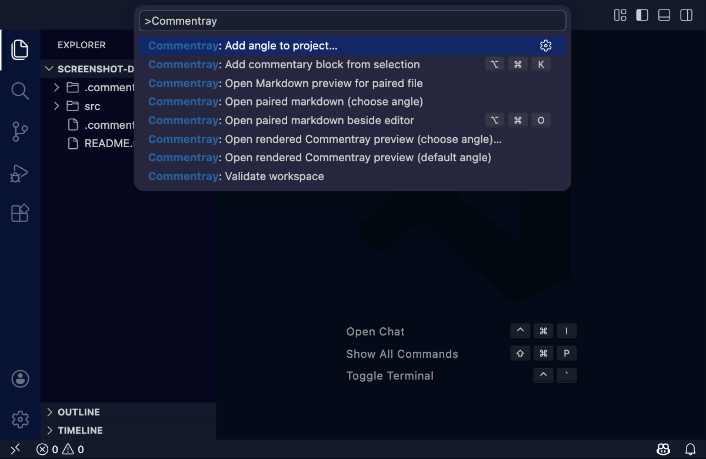

## Open paired markdown beside the editor

**SideTrack: Open paired markdown beside editor** opens or creates `.sidetrack/source/<path-to-primary>.md` for the active file and lays it out beside the source (scroll sync is configurable in settings).

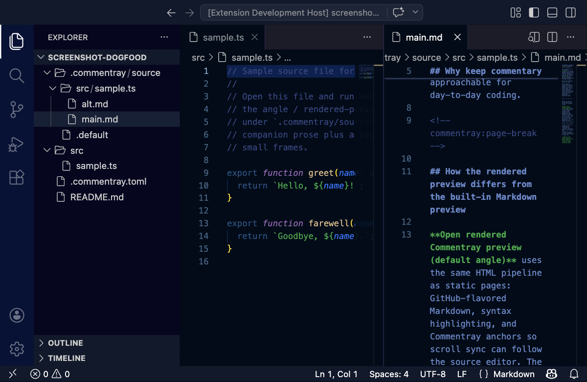

## Open paired markdown (choose angle)

When multiple [angles](https://github.com/d-led/sidetrack/blob/main/docs/spec/storage.md) apply, **SideTrack: Open paired markdown (choose angle)** offers a quick pick so you pick which companion file to open.

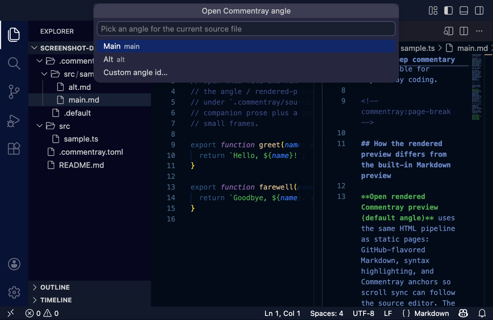

## Add side-track block from selection

**SideTrack: Add side-track block from selection** appends a new `<!-- sidetrack:block … -->` region to the paired Markdown, updates `.sidetrack/metadata/index.json`, and focuses the placeholder.

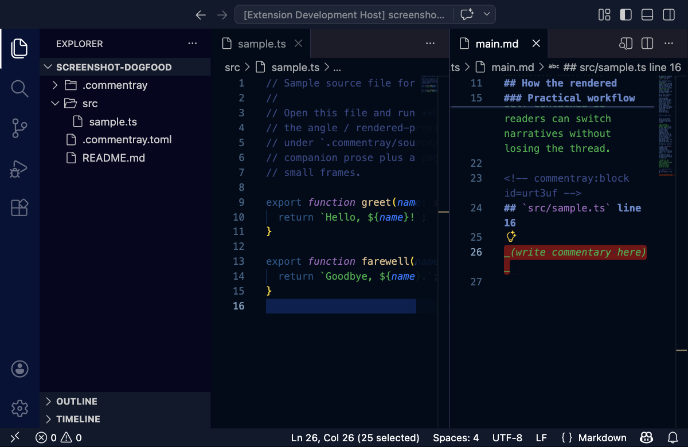

## Add angle to project

**SideTrack: Add angle to project…** registers another companion Markdown angle for the workspace (same “active folder” rules as validate).

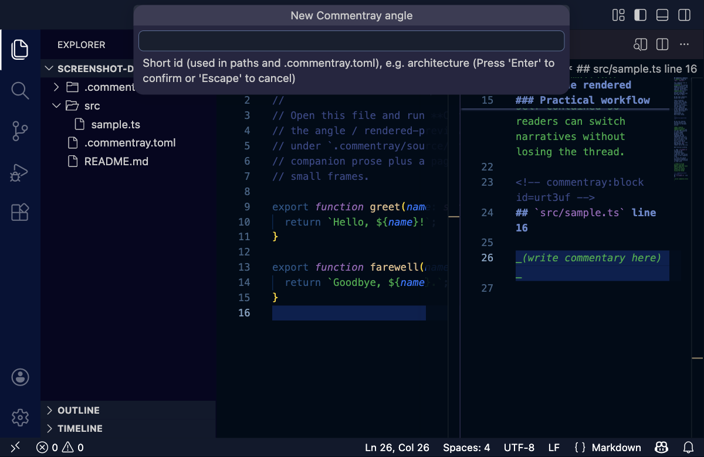

## Open Markdown preview for paired file

**SideTrack: Open Markdown preview for paired file** uses VS Code’s built-in preview on the paired `.md`.

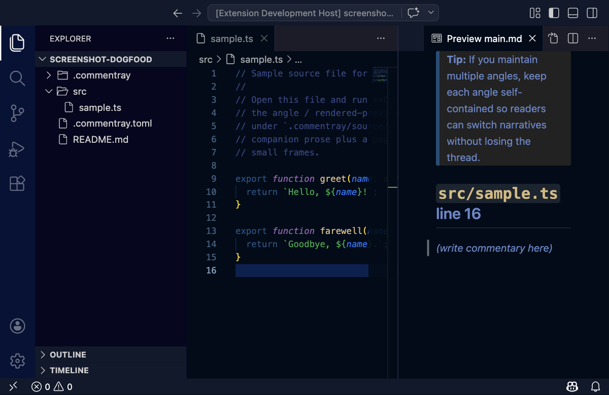

## Open rendered SideTrack preview (default angle)

**SideTrack: Open rendered SideTrack preview (default angle)** opens the same HTML pipeline as static pages in a webview beside the source. The first frame is the command palette with the command highlighted; the second is the rendered preview.

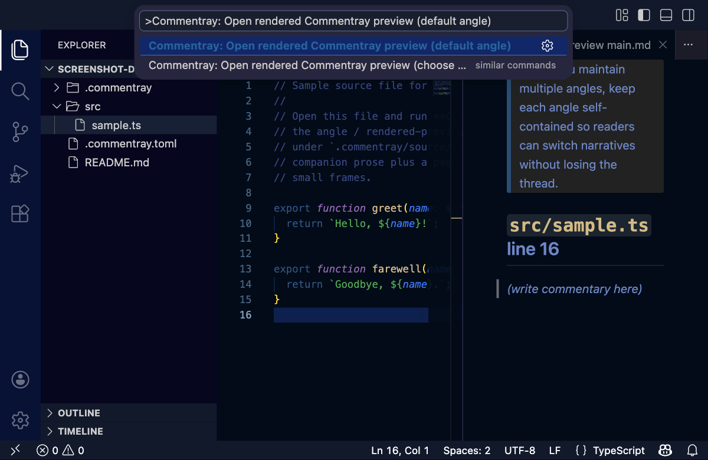

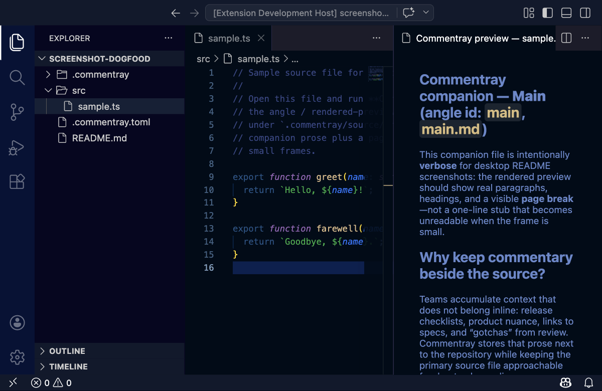

## Open rendered SideTrack preview (choose angle)

**SideTrack: Open rendered SideTrack preview (choose angle)…** opens the angle quick pick, then renders the chosen companion (here **Alt**) with the same preview stack.

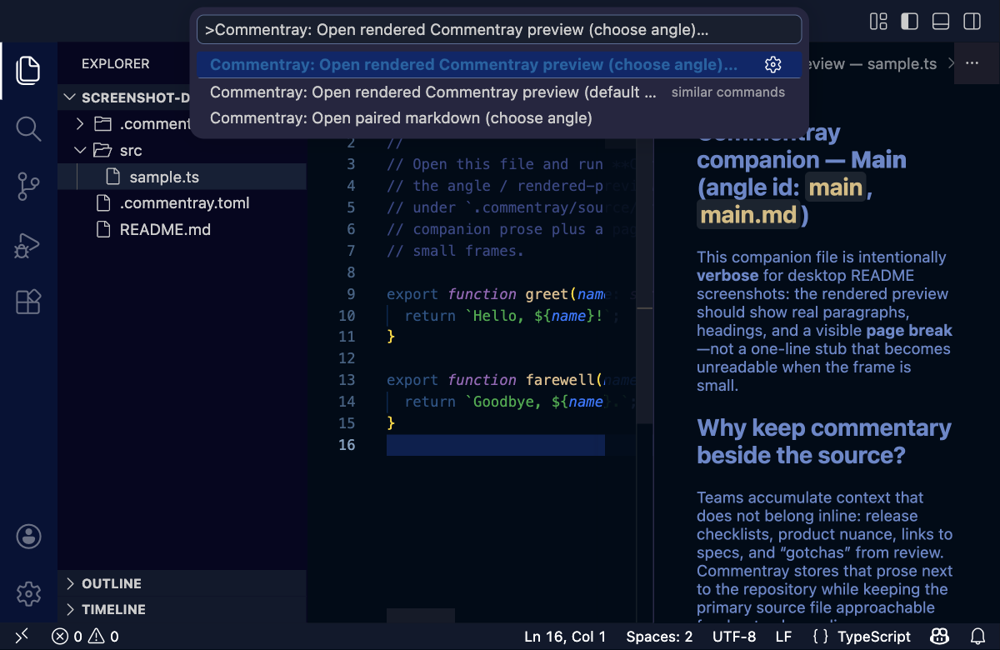

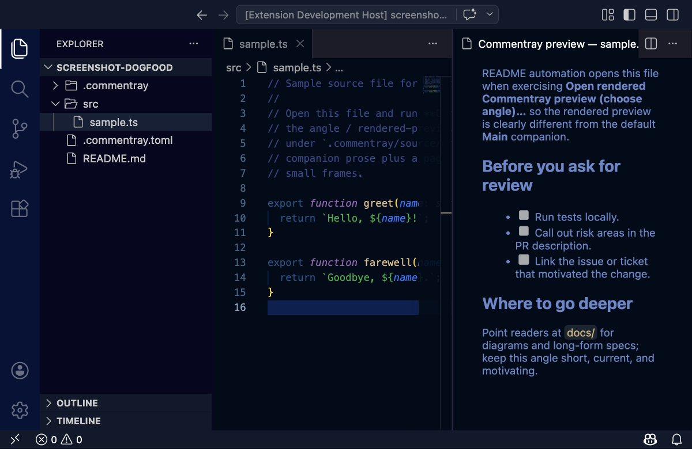

## Validate workspace

**SideTrack: Validate workspace** runs the same checks as `sidetrack validate` and streams results to the **SideTrack** output channel (focus output if you want the log in frame).

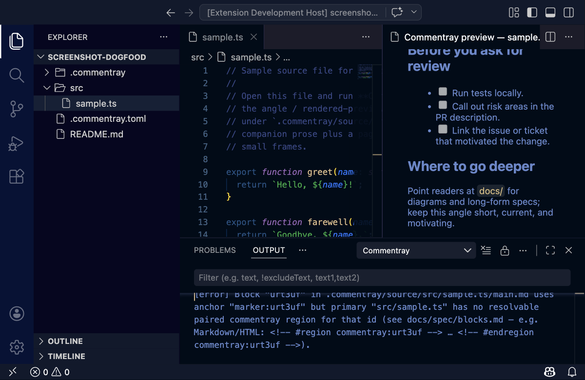

---

## Maintainer: refreshing these PNGs

### Commands (repository root)

| Goal                                                                                 | Bash (preferred)                                            | npm alias                                                   |
| ------------------------------------------------------------------------------------ | ----------------------------------------------------------- | ----------------------------------------------------------- |
| Regenerate **desktop** `vscode-*.png` here                                           | `bash scripts/refresh-vscode-readme-screenshots-desktop.sh` | `npm run extension:vscode-readme-screenshots:desktop`       |
| Same in a **clean git worktree** (or optional clone), then copy PNGs back            | `bash scripts/sidetrack-screenshots-in-fresh-worktree.sh`   | `npm run extension:vscode-readme-screenshots:desktop:fresh` |
| **Manual** EDH on monorepo root (you save PNGs)                                      | `bash scripts/refresh-vscode-readme-screenshots-manual.sh`  | `npm run extension:vscode-readme-screenshots`               |
| **Root README** companion (manual, save under `.sidetrack/source/README.md/assets/`) | `bash scripts/refresh-root-readme-screenshots.sh`           | `npm run extension:sidetrack-screenshots`                   |

One-time for desktop automation: `npx playwright install chromium`. Optional env: `VSCODE_TEST_VERSION`, `SIDETRACK_VSCODE_VIEWPORT_WIDTH` / `HEIGHT` (defaults 1200×780), `SIDETRACK_VSCODE_ZOOM_LEVEL` (default 2), `SIDETRACK_DESKTOP_SCREENSHOT_SKIP_BUILD=1` if `packages/vscode/dist/extension.js` is already built.

Fresh worktree clone URL (optional): `SIDETRACK_SCREENSHOT_CLONE_URL` — see header in `scripts/sidetrack-screenshots-in-fresh-worktree.sh`.

More on asset layout: [storage — images](https://github.com/d-led/sidetrack/blob/main/docs/spec/storage.md).

### How desktop screenshot **scenarios** are defined

Automation is **not** Cypress: one Node driver script drives a disposable VS Code window.

1. **Workspace** — the Extension Development Host opens **`packages/vscode/fixtures/dogfood`** (see [the fixture `README.md`](../../../../../packages/vscode/fixtures/dogfood/README.md)). Primary source for the scripted tour is **`src/sample.ts`**; paired Markdown appears under `.sidetrack/source/…` when commands run.
2. **Driver** — [`scripts/capture-vscode-readme-screenshots-desktop.mjs`](../../../../../scripts/capture-vscode-readme-screenshots-desktop.mjs) launches VS Code (via `@vscode/test-electron`), connects with Playwright CDP, then runs a **fixed sequence**: command palette in **`>`** (run-command) mode, `shot(page, "vscode-….png")` calls, editor focus groups, sleeps. It also seeds **verbose** `main.md` / `alt.md` under `.sidetrack/source/src/sample.ts/` (including a `<!-- sidetrack:page-break -->` demo) so rendered-preview frames are readable. Output files go to **this** directory’s `./assets/`.
3. **Changing or adding a frame** — edit that `.mjs`: extend `main()` after `ensureBuilt()`, reuse `runPaletteQuery` / `openSampleTs` / `dismissOverlays`, match command titles to [`packages/vscode/package.json`](../../../../../packages/vscode/package.json) → `contributes.commands` (**`SideTrack: …`** strings). Tune `afterEnterMs` if UI lags. Keep filenames aligned with the `` references in this file and in [`packages/vscode/README.md`](../../../../../packages/vscode/README.md).
4. **Manual scenarios** — use dogfood or your own folder; follow [`scripts/refresh-vscode-readme-screenshots-manual.sh`](../../../../../scripts/refresh-vscode-readme-screenshots-manual.sh) (opens EDH + prints where to save files).
